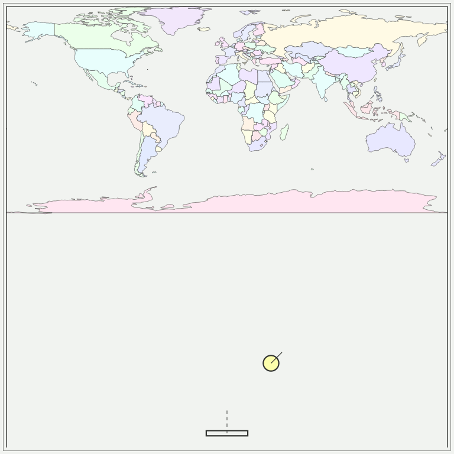

# map-breaker

### mini game made with js and SVG


demo: http://www.stefanobovio.com/map-breaker/

demo with geoBonne projection: http://www.stefanobovio.com/map-breaker/?geoBonne

inputs

- `A` key move left 
- `D` key move left 


default values work for an image with width 1024px and height 512px that covers the global extension.

this GUI uses projections from following library:

- [d3-geo-projection](https://github.com/d3/d3-geo-projection)

country.geo.json data from https://github.com/johan/world.geo.json

### MapBraker Options:

- `propertyKey` property to display after it a feature 
- `leftKeyCode` change key code to move left
- `rightKeyCode` change key code to move right

### Example

```js
var projection = 'geoBonne'; // or undefined for EPSG:4326
fetch('countries.geo.json')
    .then(function (res) {
        res.json()
            .then(function (featureCollection) {
                const mapBreaker = new MapBreaker(
                    '#map', // selector for div element
                    {
                        propertyKey: 'name',
                        leftKeyCode: 65,
                        rightKeyCode: 68
                    });
                mapBreaker.wall(featureCollection, projection);
                mapBreaker.loop();
            });
    });
```
### Note

Work only with `Polygon` and `MultiPolygon` feature

### Development

`npm install`

`npm start` -> `http://localhost:8085`
